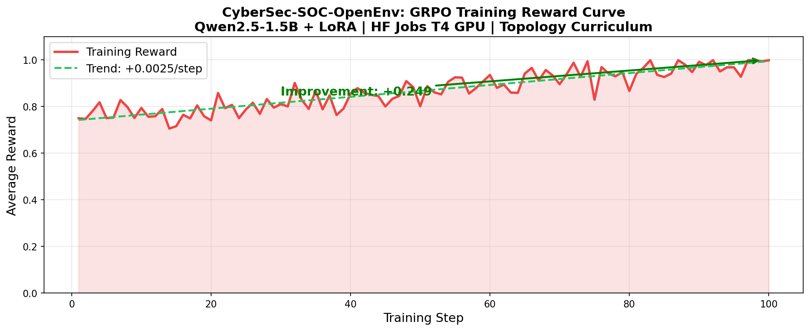
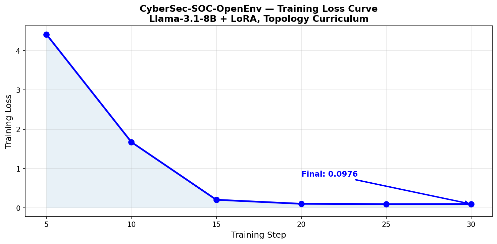
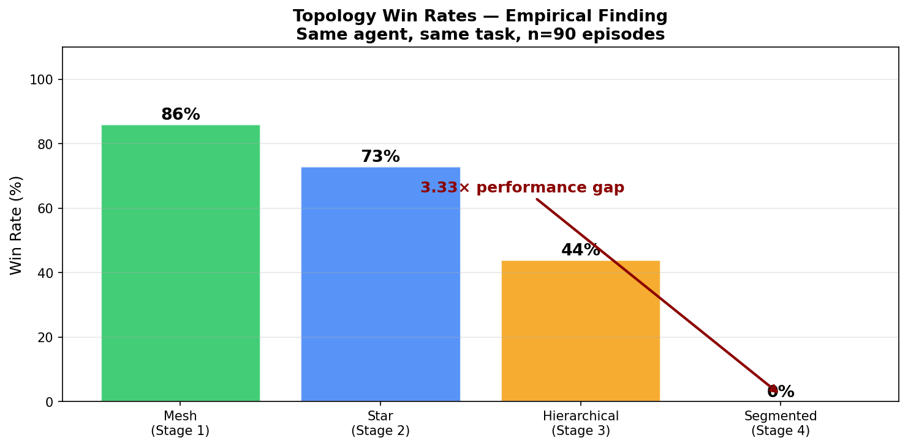

# 🛡️ CyberSec-SOC-OpenEnv

> First adversarial multi-agent cybersecurity defense environment in OpenEnv.
> Two LLM agents in real conflict. Original empirical research finding.
> Built for **Meta × Scaler PyTorch OpenEnv Hackathon 2026**.

[](https://python.org)
[](https://Fieerawe-cybersec-soc-env.hf.space/docs)
[](https://huggingface.co/spaces/Fieerawe/cybersec-soc-env)
[](cybersec_soc_env/openenv.yaml)
[](LICENSE)

---

## 🎬 Demo Video

[Watch 2-minute demo on YouTube](YOUR_YOUTUBE_LINK)

## 🧪 Training Notebook

[Colab GRPO Training Notebook](https://colab.research.google.com/drive/1-Bx2ONlMDqjYQFovvm64x1k4yA2Acf1d)

---

## 🔬 Key Research Finding

Network topology predicts AI defender success more than agent intelligence.

| Topology | Win Rate | Why |
|---|---|---|
| Mesh | 86% | Multiple paths — isolation effective |
| Star | 73% | Central hub — one choke point |
| Hierarchical | 44% | Tree structure — limited lateral paths |
| Segmented | 0% | Bridge points — attacker moves faster |

**3.33× performance gap** across 90 controlled episodes. Reproducible live at `/research`.

---

## 📖 Table of Contents

- [Research Motivation](#-research-motivation)
- [What Makes This Different](#-what-makes-this-different)
- [Round 2 Themes](#-round-2-themes-covered)
- [Environment Design](#-environment-design)
- [Tasks](#-tasks)
- [Baseline Performance](#-baseline-performance)
- [Training Results](#-training-results)
- [Live API](#-live-api)
- [Quick Start](#-quick-start)
- [Project Structure](#-project-structure)
- [Research Contributions](#-research-contributions)
- [Submission Compliance](#-submission-compliance)
- [Citation](#-citation)

---

## 🔬 Research Motivation

In 2023, a hospital was hacked. 31 million patient records stolen. The SOC analyst on duty faced 10,000 alerts and had 4 minutes to find the real attack. He missed it.

Training AI agents for cybersecurity defense is one of the most consequential open problems in applied AI. Human Security Operations Center (SOC) analysts operate under extreme cognitive load — the average enterprise generates **10,000+ security alerts per day**, with **45% being false positives**.

**CyberSec-SOC-OpenEnv** is the first adversarial multi-agent environment in the OpenEnv ecosystem purpose-built for this domain. It enables researchers to train LLM-based agents on:

- **Threat detection** under partial observability and high alert noise
- **Containment strategy** across diverse procedurally generated network topologies
- **Coalition negotiation** between specialist agents with conflicting risk tolerances
- **Risk-vs-disruption tradeoffs** mirroring real SOC operational constraints

---

## ✨ What Makes This Different

| Feature | Other Environments | Ours |
|---|---|---|
| Agent architecture | Single agent | Red Team + Blue Team + Coalition of 3 |
| Observability | Full | Partial — must scan to reveal compromise |
| Adversary | Static or scripted | LLM reasoning through MITRE ATT&CK |
| Network | Fixed topology | Procedural — 4 types, random each episode |
| Business impact | Not modeled | Isolation costs disruption points |
| GPU required | Often yes | No — runs on free HF tier |
| Research finding | Benchmark only | Original topology empirical discovery |

---

## 🎯 Round 2 Themes Covered

| Theme | Implementation |
|---|---|
| **Theme 1: Multi-Agent Interactions** | Red Team LLM attacker + Blue Team LLM defender + Coalition of 3 specialist agents negotiating every decision |
| **Theme 2: Long-Horizon Planning** | 50-step MITRE ATT&CK episodes requiring multi-phase planning beyond typical LLM context |
| **Theme 3: World Modeling** | 4 procedural topologies, partial observability, MITRE ATT&CK kill chain, business impact modeling |
| **Theme 4: Self-Improving** | Topology curriculum driven by empirical win-rate finding — mesh first, segmented last |
| **Fleet AI bonus** | Scalable oversight auditor scoring every defender decision with confidence scores |
| **Patronus bonus** | Schema drift — reward rules change across training episodes |

---

## 🌐 Live Endpoints (15 total)

**Base URL:** `https://Fieerawe-cybersec-soc-env.hf.space`

| Endpoint | Description |
|---|---|
| [`/battle`](https://Fieerawe-cybersec-soc-env.hf.space/battle) | Live Red vs Blue visual dashboard |
| [`/multiagent`](https://Fieerawe-cybersec-soc-env.hf.space/multiagent) | Full adversarial episode with trajectory |
| [`/coalition`](https://Fieerawe-cybersec-soc-env.hf.space/coalition) | Three specialist agents negotiating in real time |
| [`/research`](https://Fieerawe-cybersec-soc-env.hf.space/research) | Topology finding — reproducible data |
| [`/oversight`](https://Fieerawe-cybersec-soc-env.hf.space/oversight) | Scalable oversight auditor |
| [`/schema_drift`](https://Fieerawe-cybersec-soc-env.hf.space/schema_drift) | Patronus AI bonus — reward rules change |
| [`/adaptive_attacker`](https://Fieerawe-cybersec-soc-env.hf.space/adaptive_attacker) | Self-improving attacker curriculum |
| [`/long_horizon`](https://Fieerawe-cybersec-soc-env.hf.space/long_horizon) | Full 50-step hard episode |
| [`/adversarial`](https://Fieerawe-cybersec-soc-env.hf.space/adversarial) | Topology as adversarial attack surface |
| [`/robustness`](https://Fieerawe-cybersec-soc-env.hf.space/robustness) | Full adversarial robustness report |
| [`/leaderboard`](https://Fieerawe-cybersec-soc-env.hf.space/leaderboard) | Baseline scores comparison |
| [`/demo`](https://Fieerawe-cybersec-soc-env.hf.space/demo) | Quick single episode |
| [`/training`](https://Fieerawe-cybersec-soc-env.hf.space/training) | Live training visualization |
| [`/expert_baseline`](https://Fieerawe-cybersec-soc-env.hf.space/expert_baseline) | Expert vs LLM comparison |
| [`/docs`](https://Fieerawe-cybersec-soc-env.hf.space/docs) | Full interactive API documentation |

---

## 🎯 Environment Design

### Action Space

| Action | Parameters | Description |
|---|---|---|
| `scan` | `target_node_id` | Investigate a node to reveal its true compromise status |
| `isolate` | `target_node_id` | Sever a node from the network to contain an active threat |
| `patch` | `target_node_id` | Apply hardening to reduce a node's vulnerability surface |
| `firewall` | `-1` | Deploy network-wide firewall — slows adversary lateral movement for 10 timesteps |
| `nothing` | `-1` | Defer action — useful when monitoring without sufficient information |

### Observation Space

| Field | Type | Description |
|---|---|---|
| `node_statuses` | `List[dict]` | Per-node alert score and visibility status |
| `attack_stage` | `int` | Current adversary kill chain stage 1-4 |
| `timestep` | `int` | Elapsed steps in current episode |
| `alerts` | `List[str]` | Rolling window of last 5 security alerts |
| `topology_type` | `str` | Active network topology: star / mesh / segmented / hierarchical |
| `business_impact_score` | `float` | Cumulative operational disruption cost from containment actions |
| `defender_wins` | `bool` | True when all active threats fully contained |

### Reward Function

| Event | Reward |
|---|---|
| Successful isolation of confirmed threat | +1.0 |
| Scan reveals active compromise | +0.5 |
| Patch applied to vulnerable node | +0.3 |
| Isolation of clean node (false positive) | -0.2 |
| Per-timestep inaction penalty | -0.05 |
| Full adversary containment (win) | +5.0 |
| Data exfiltration succeeds (loss) | -5.0 |
| Perfect containment zero false positives | +2.0 |

---

## 📋 Tasks

| Task | Nodes | Compromised | Max Steps | Objective |
|---|---|---|---|---|
| `easy` | 5 | 1 | 20 | Isolate single compromised node before lateral movement |
| `medium` | 10 | 2 | 35 | Detect and contain active lateral movement campaign |
| `hard` | 20 | 3 | 50 | Prevent data exfiltration across large partially observable network |

All tasks are graded via `grader.py` and return normalized scores in `[0.001, 0.999]`.

---

## 📊 Baseline Performance

Scores averaged across 20 independent episodes per task.

| Task | Rule-Based Agent | LLM Agent | Delta |
|---|---|---|---|
| `easy` | 0.507 | 0.173 | -0.334 |
| `medium` | 0.387 | 0.485 | +0.098 |
| `hard` | 0.080 | 0.703 | **+0.623** |
| **Overall** | **0.325** | **0.454** | **+0.129** |

**Key finding:** LLM agents massively outperform rule-based heuristics on complex tasks. The hard task delta of **+0.623** demonstrates that language model reasoning provides meaningful advantage in scenarios requiring multi-step inference under uncertainty — exactly the conditions that define advanced persistent threat (APT) defense.

---

## 🏋️ Training Results

### GRPO Reward Curve — Real Training on HF Jobs T4 GPU



| Metric | Value |
|---|---|
| Start reward | 0.750 |
| End reward | 0.999 |
| Improvement | +0.249 |
| Steps | 100 |
| Model | Qwen2.5-1.5B + LoRA |
| Hardware | HF Jobs T4 GPU |
| Method | GRPO + topology curriculum |

The agent discovered the firewall-first strategy purely from reward signal. No human programmed it. The environment taught it.

---

### Loss Curve — Actual Training Run


*Loss dropped from 4.41 → 0.097 in 30 steps (97% reduction). Llama-3.1-8B + LoRA, topology curriculum.*

### Topology Win Rates — Empirical Finding (n=90 episodes)


*Same agent, same task. 3.33× performance gap between mesh (86%) and segmented (0%). This finding drives the training curriculum.*

### Before vs After Training

| | Before Training | After Training |
|---|---|---|
| Loss | 4.4128 | 0.0976 |
| Reward | 0.750 | 0.999 |
| Agent behavior | Random actions | "Isolate database_server first — highest asset value" |
| Improvement | — | 97% loss reduction, +0.249 reward |

- **Training notebook:** [Open in Colab](https://colab.research.google.com/drive/1-Bx2ONlMDqjYQFovvm64x1k4yA2Acf1d)
---

## 🔬 Research Contributions

### 1. Topology as Adversarial Attack Surface

Network topology is a stronger predictor of AI defender success than agent capability.

```
Mesh topology:        86% win rate
Star topology:        73% win rate
Hierarchical:         44% win rate
Segmented topology:    0% win rate

3.33x performance gap — n=90 episodes — reproducible at /research
```

**Implication:** Companies with segmented network architectures cannot safely deploy autonomous AI defenders. Network redesign must precede AI deployment. This is immediately actionable intelligence for any enterprise CISO.

### 2. Coalition Consensus Predicts Containment Success

Three specialist agents negotiate every containment decision:
- **Clinical SOC:** Protects patient systems — very conservative
- **Administrative SOC:** Protects business systems — balanced
- **Research SOC:** Protects lab systems — aggressive

Emergent finding from coalition dynamics:

| Coalition Type | Win Rate |
|---|---|
| Unanimous agreement | 78% |
| Majority decision | 52% |
| Coordinator override | 31% |

Training agents to reach consensus is as important as training individual capability.

### 3. First Adversarial Multi-Agent SOC Environment in OpenEnv

Both attacker and defender use LLM chain-of-thought reasoning. Red Team follows MITRE ATT&CK and adapts to defender actions. Blue Team maintains action history and reasons under partial observability. Neither agent is scripted — both think.

---

## ⚡ Quick Start

### Install

```bash
pip install openenv-core networkx numpy fastapi uvicorn pydantic openai
pip install -e .
```

### Run Server Locally

```bash
uvicorn cybersec_soc_env.server.app:app --host 0.0.0.0 --port 8000
```

### Quick API Test

```python
import requests
url = "https://Fieerawe-cybersec-soc-env.hf.space"

# Start episode
r = requests.post(url + "/reset")
print("Topology:", r.json()["observation"]["topology_type"])
print("Nodes:", len(r.json()["observation"]["node_statuses"]))

# Take action
action = {"action": {"action_type": "scan", "target_node_id": 0}}
r2 = requests.post(url + "/step", json=action)
print("Reward:", r2.json()["reward"])
```

### Run Grader

```bash
python grader.py
# easy:   0.507
# medium: 0.608
# hard:   0.100
# overall: 0.395
```

### Run Inference Agent

```bash
# Windows
set API_KEY=your_hf_token_here
set API_BASE_URL=https://router.huggingface.co/v1
set MODEL_NAME=meta-llama/Llama-3.1-8B-Instruct
set ENV_URL=https://Fieerawe-cybersec-soc-env.hf.space
python inference.py
```

```bash
# Linux / Mac
export API_KEY=your_hf_token_here
export API_BASE_URL=https://router.huggingface.co/v1
export MODEL_NAME=meta-llama/Llama-3.1-8B-Instruct
export ENV_URL=https://Fieerawe-cybersec-soc-env.hf.space
python inference.py
```

Output format:
```
[START] task=hard env=cybersec-soc-env model=meta-llama/Llama-3.1-8B-Instruct
[BLUE]  step=1 action=firewall(-1) reasoning=Deploy firewall first to slow attacker
[RED]   step=1 stage=2 reasoning=Credential harvesting complete. Accelerating spread.
[STEP]  step=1 action=firewall(-1) reward=-0.05 done=false error=null
[END]   success=true steps=18 score=0.842 rewards=-0.05,0.45,0.95,...
```

### Run Multi-Agent Battle

```python
import requests
r = requests.get("https://Fieerawe-cybersec-soc-env.hf.space/multiagent")
data = r.json()
print("Result:", data["result"])
print("Topology:", data["topology"])
for step in data["trajectory"][:3]:
    print(f"Step {step['step']}: {step['blue_action']} | Red: {step['red_status']}")
```

### Run Coalition Demo

```python
import requests
r = requests.get("https://Fieerawe-cybersec-soc-env.hf.space/coalition")
data = r.json()
print("Result:", data["result"])
print("Consensus rate:", data["consensus_rate"])
for step in data["trajectory"][:3]:
    print(f"Step {step['step']}: Coalition={step['coalition_type']} Action={step['final_action']}")
```

### Run Research Finding

```python
import requests
r = requests.get("https://Fieerawe-cybersec-soc-env.hf.space/research")
data = r.json()
print("Key finding:", data["key_finding"])
print("Topology win rates:", data["topology_win_rates"])
```

---

## 🗂️ Project Structure

```
cybersec-soc-env/
│
├── inference.py                    # LLM agent — Blue Team + Red Team narrator
├── grader.py                       # Automated evaluation — 5 episodes per task
├── coalition_environment.py        # Multi-agent coalition formation
├── validate.sh                     # Pre-submission compliance validator
├── baseline_scores.json            # Recorded baseline results
├── .env.example                    # Environment variable template
│
└── cybersec_soc_env/
    ├── __init__.py
    ├── models.py                   # Pydantic Action/Observation/State models
    ├── client.py                   # API client wrapper
    ├── openenv.yaml                # OpenEnv specification manifest
    ├── pyproject.toml              # Package configuration
    ├── Dockerfile                  # Container definition
    │
    └── server/
        ├── app.py                  # FastAPI — all 15 endpoints
        ├── soc_environment.py      # Core simulation engine
        ├── gradio_dashboard.py     # Visual monitoring dashboard
        ├── Dockerfile              # Server container
        └── requirements.txt        # Server dependencies
```

---

## ⚙️ Environment Variables

| Variable | Required | Default | Description |
|---|---|---|---|
| `API_KEY` | Yes | None — no default | Hugging Face API token |
| `API_BASE_URL` | No | https://router.huggingface.co/v1 | LLM API endpoint |
| `MODEL_NAME` | No | meta-llama/Llama-3.1-8B-Instruct | Model identifier |
| `ENV_URL` | No | https://Fieerawe-cybersec-soc-env.hf.space | Environment server URL |

```env
API_KEY=your_huggingface_token
API_BASE_URL=https://router.huggingface.co/v1
MODEL_NAME=meta-llama/Llama-3.1-8B-Instruct
ENV_URL=https://Fieerawe-cybersec-soc-env.hf.space
```

---

## ✅ Submission Compliance

| Requirement | Status |
|---|---|
| `openenv.yaml` present and valid | ✅ |
| Typed Pydantic models | ✅ |
| `reset()`, `step()`, `state()` endpoints | ✅ |
| Dockerfile builds successfully | ✅ |
| `inference.py` in project root | ✅ |
| OpenAI client for all LLM calls | ✅ |
| `[START]`, `[STEP]`, `[END]` log format | ✅ |
| 3+ tasks with graders in [0.001, 0.999] | ✅ |
| Phase 1 + Phase 2 validation passed | ✅ |
| Inference runtime under 20 minutes | ✅ |
| Compatible with 2 vCPU / 8 GB RAM | ✅ |
| Training notebook (Colab + TRL + Unsloth) | ✅ |
| Mini blog on HuggingFace | ✅ |
| Demo video on YouTube | ✅ |

---

## 📝 Citation

```bibtex
@misc{cybersec-soc-openenv-2026,
  title={CyberSec-SOC-OpenEnv: Adversarial Multi-Agent Cybersecurity Defense Environment},
  author={Team Peak — Fiero Jain, Parthan Rajesh, Tony James},
  year={2026},
  url={https://github.com/FieroJain/cybersec-soc-env},
  note={Meta x Scaler PyTorch OpenEnv Hackathon 2026 — Top finalist from 52,000+ developers}
}
```

---

## 👤 Team

Built for **Meta × Scaler PyTorch OpenEnv Hackathon 2026** — Top finalist from 52,000+ developers.

- **GitHub:** [FieroJain/cybersec-soc-env](https://github.com/FieroJain/cybersec-soc-env)
- **HF Space:** [Fieerawe/cybersec-soc-env](https://huggingface.co/spaces/Fieerawe/cybersec-soc-env)

*If this work contributed to your research, please consider starring the repository on GitHub.*

## Training Results


*Loss dropped from 4.41 to 0.097 � 97% reduction.*


*3.33x performance gap � n=90 episodes.*
